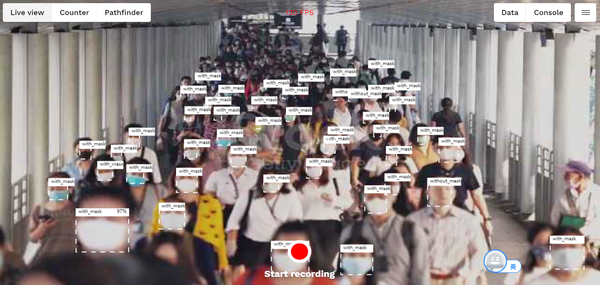

# mask_detection
## Build docker image
vi Dockerfile
```
FROM opendatacam/opendatacam:v3.0.2-xavier
WORKDIR /var/local/darknet

RUN mkdir mask
COPY mask/mask.data mask/
COPY mask/mask.names mask/
COPY mask/yolov4-tiny-mask.weights mask/
COPY mask/yolov4-tiny-masks.cfg mask/
COPY demo1.mp4 /var/local/darknet/opendatacam_videos/
COPY demo2.mp4 /var/local/darknet/opendatacam_videos/

WORKDIR /var/local/opendatacam
COPY config.json config.json
CMD ["./launch.sh"]
```

## Push image
```
sudo docker build -t mask_detection:v2
sudo docker tag mask_detection :v2 raphaelsun/mask_detection:v2
sudo docker push raphaelsun/mask_detection:v2
```

## customize config.json

- customize the input file
- customize the model
 

## Kubernetes deployment
```
kubectl create configmap opendatacam --from-file=config.json --dry-run -o yaml | kubectl apply -f -
kubectl apply -f opendatacam-mongo-pvc.yaml
kubectl apply -f opendatacam-mongo-deployment.yaml
kubectl apply -f opendatacam-mongo-service.yaml
kubectl apply -f opendatacam-deployment.yaml
kubectl apply -f opendatacam-service.yaml
kubectl get svc
```

## Detection test
