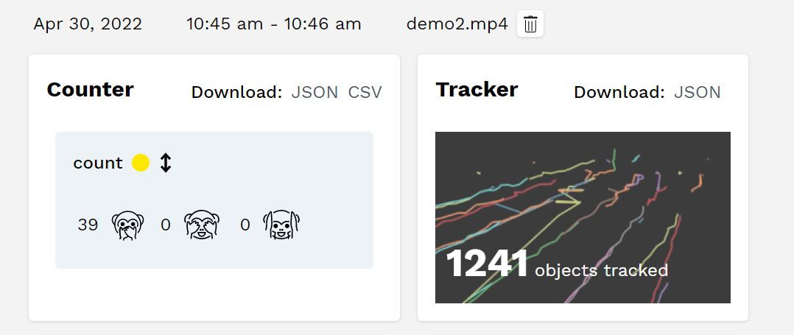

# mask_detection

Faced mask is important topic since pandemic. our project aims to provide an integration system of mask detection and alarm with all AI computation performed at the edge, which can detect people in the view of camera and determine whether they are wearing a mask properly.

This project can run on Linux and GPU enabled hardware, especially for Nvidia Jetson nano and Xavier NX. Since this scenario need a light weight hardware, Jetson nano is more cost-effective.

This project is based on the YOLOv4 neural networks and uses Kaggle's Face Mask Detection dataset for training model.
More abou the YOLOv4, please refer to:
 [Scaled-YOLOv4: Scaling Cross Stage Partial Network](https://openaccess.thecvf.com/content/CVPR2021/html/Wang_Scaled-YOLOv4_Scaling_Cross_Stage_Partial_Network_CVPR_2021_paper.html) 
 [YOLOv4: Optimal Speed and Accuracy of Object Detection](https://arxiv.org/abs/2004.10934) 

our test environment is Nvidia Jetson Xavier NX specifically. All AI processing is handled by NVIDIA’s DeepStream video analytics framework.

## Build docker image
vi Dockerfile
```
FROM opendatacam/opendatacam:v3.0.2-xavier
WORKDIR /var/local/darknet

RUN mkdir mask
COPY mask/mask.data mask/
COPY mask/mask.names mask/
COPY mask/yolov4-tiny-mask.weights mask/
COPY mask/yolov4-tiny-masks.cfg mask/
COPY demo1.mp4 /var/local/darknet/opendatacam_videos/
COPY demo2.mp4 /var/local/darknet/opendatacam_videos/

WORKDIR /var/local/opendatacam
COPY config.json config.json
CMD ["./launch.sh"]
```

## Push image

```
sudo docker build -t mask_detection:v2
sudo docker tag mask_detection :v2 raphaelsun/mask_detection:v2
sudo docker push raphaelsun/mask_detection:v2
```

## customize config.json

- customize the input file
- customize the model

## Kubernetes deployment
```
kubectl create configmap opendatacam --from-file=config.json --dry-run -o yaml | kubectl apply -f -
kubectl apply -f opendatacam-mongo-pvc.yaml
kubectl apply -f opendatacam-mongo-deployment.yaml
kubectl apply -f opendatacam-mongo-service.yaml
kubectl apply -f opendatacam-deployment.yaml
kubectl apply -f opendatacam-service.yaml
kubectl get svc
```

## Detection test
there are there 3 classes:
- wear mask properly
- wear mask improperly
- no mask

counter

